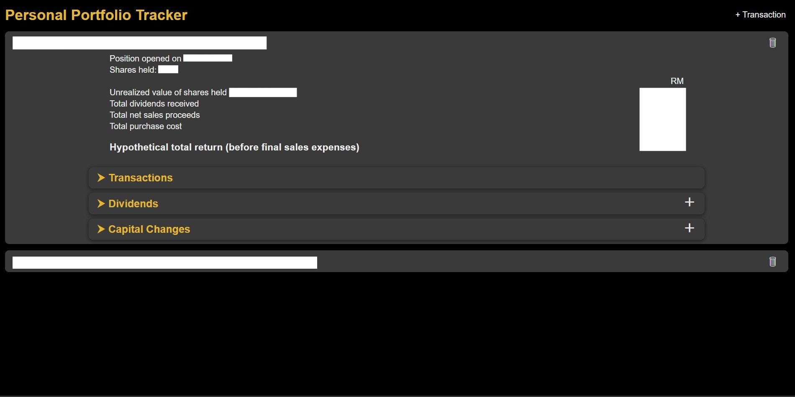
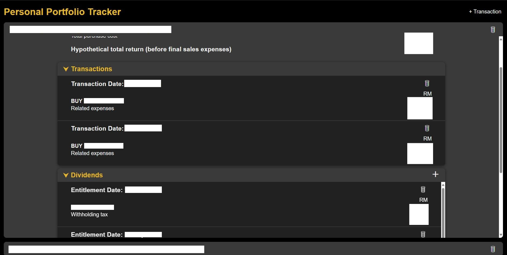
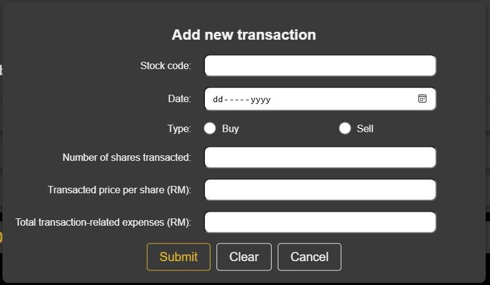

# Personal Portfolio Tracker 

This is a full-stack application to be used to track the returns of personal portfolio.

Tech Stack:
- Frontend: React
- Backend: ASP.NET Core (with xUnit for unit testing)
- Database: MariaDB
- Containerization: Docker

## React (Frontend)

The frontend application of the Personal Portfolio Tracker project is developed with **React**.

### Components

A React application consists of reusable blocks of UI elements called `Components`.

In this project, the Components involved are:

- Lists of entities:
    - Positions
    - Transaction records for each Position
    - Dividend records for each Position
    - Capital change records for each Position

- Dialog Boxes

- Buttons

These Components are structured in a way that reflects the hierarchical relationships between entities involved.

`Props` are used to pass information from a Component to its nested Components.

### Component Hierarchy


### Hooks

React's built-in `Hooks`:
- `useState` is used to manage stored data of Components.
- `useEffect` is used to manage side effects in response to changes or rendering of Components.

A custom Hook named `useApiCall` is created to handle the initial API call.

### Screenshots








## ASP.NET Core (Backend API)

The backend application of the Personal Portfolio Tracker project is a **RESTful API** developed with **ASP.NET Core**.

### Models

- Stock
- Position
- Transaction
- Dividend
- Capital Change
- Transaction Type
- Capital Change Type

### Object-Relational Mapping

**Entity Framework Core** (EF Core) is an object-relational mapper that provides various features to manage and interact with database from within an ASP.NET Core application.

EF Core is used for the following:
 - mapping C# OOP classes that represent entities (models) into database tables
 - defining relationships between tables
 - populating tables with initial data
 - handling queries

### External API

The application logic requires actual closing prices of stocks, which are obtained by consuming an external API.

### Caching

The external API chosen has a limit on number of API calls allowed daily. Therefore, in-memory caching is implemented with `IMemoryCache` to avoid unnecessary API calls.

Since the closing prices of stocks are only updated daily, it is unnecessary to make repeated API requests within a short period of time.

The following describes the mechanism implemented:
1. The application logic will look for cached value first.
2. If there is none or if the cache has expired, the external API will be called to fetch updated data.
3. The fetched data will be stored in cache until expiration.

### Software Architecture


### Unit Tests

Unit tests are performed to verify the application logic.

- Unit Testing framework: **xUnit**
- Mocking framework: **Moq**

## MariaDB (Database)

**MariaDB** is the database used to store persistent data.

### Entity Relationship Diagram


## Docker (Containerization)


The frontend, backend, and database of the application are containerized with Docker. Each of them runs in its own individual container that serves as an isolated environment with necessary dependencies.

`Dockerfile` defines how an image is built using the application's contents.

`docker-compose.yml` manages the configurations to set up containers.

### Secrets & Environment Variables
Sensitive values are not included in the source code. They are kept separately, and are either mounted as secrets in containers or used as environment variables in the container image building process.

For Frontend, an `.env` file must be created in the root of `./personal-portfolio-tracker-frontend`, containing the line below:
```
VITE_API_BASE_URL=*insert the base URL of backend API*
```

For Backend and Database, the following `*.txt` files must be created in the `./secrets` directory, each containing the corresponding value:

- `db_root_password.txt` - root user's password for the database.
- `db_user.txt` - created user's name for the database.
- `db_password.txt` - created user's password for the database.
- `db_name.txt` - name of the database.
- `personal_portfolio_tracker_db_connection_string.txt` - database connection string used by the backend.
- `personal_portfolio_tracker_frontend.txt` - frontend origin URL allowed by the backend.
- `stock_search_api_path.txt` - path of the external API.
- `stock_search_api_token.txt` - API token required to access the external API.